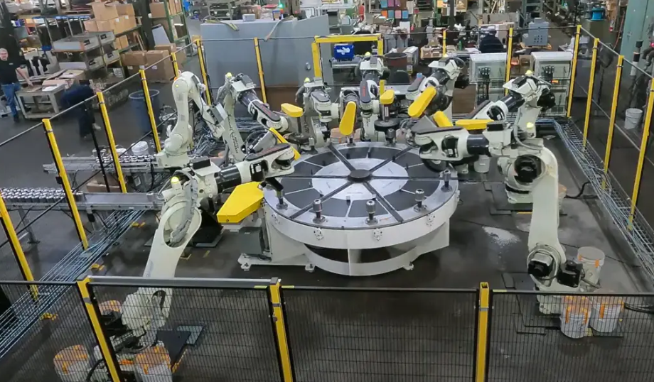
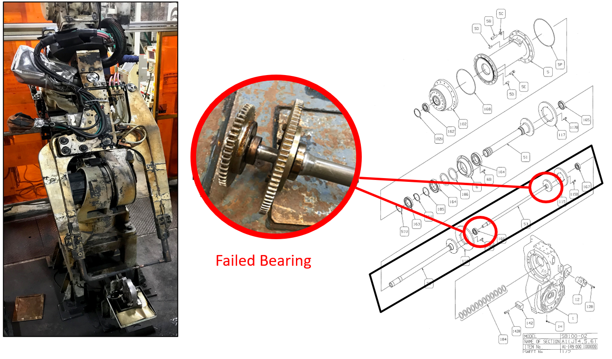
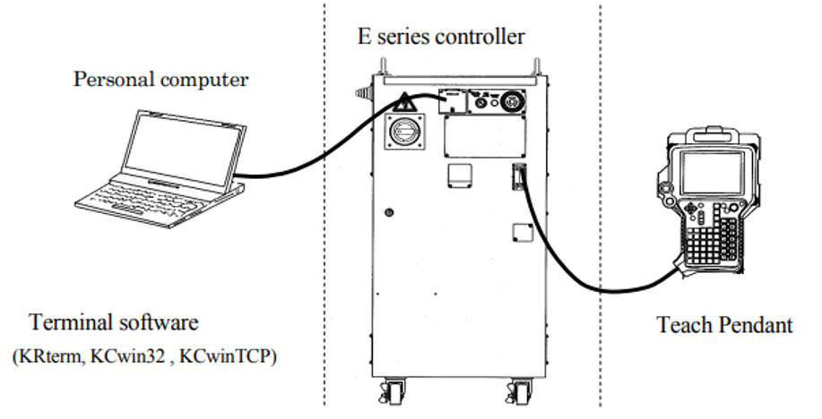
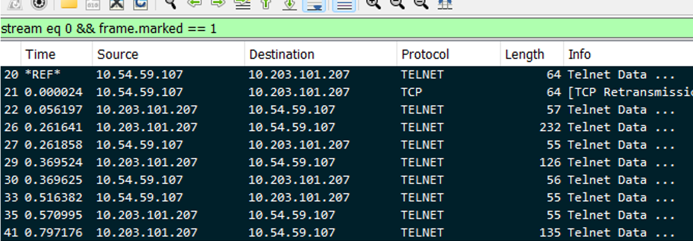
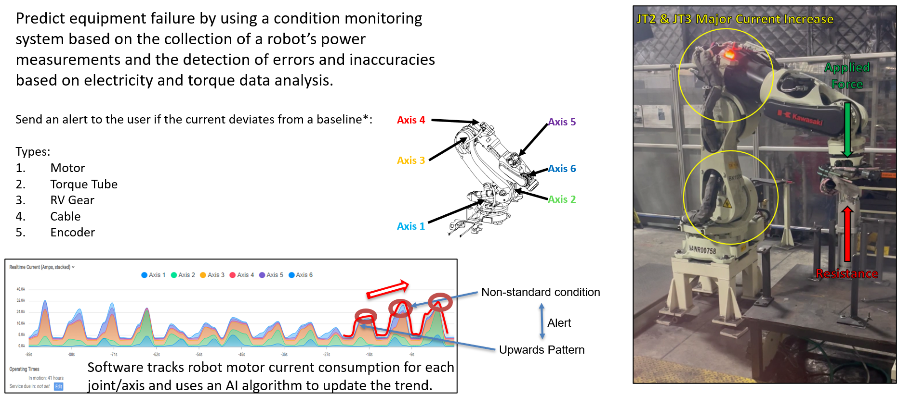
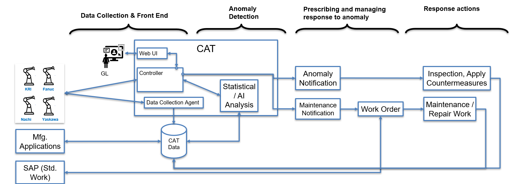
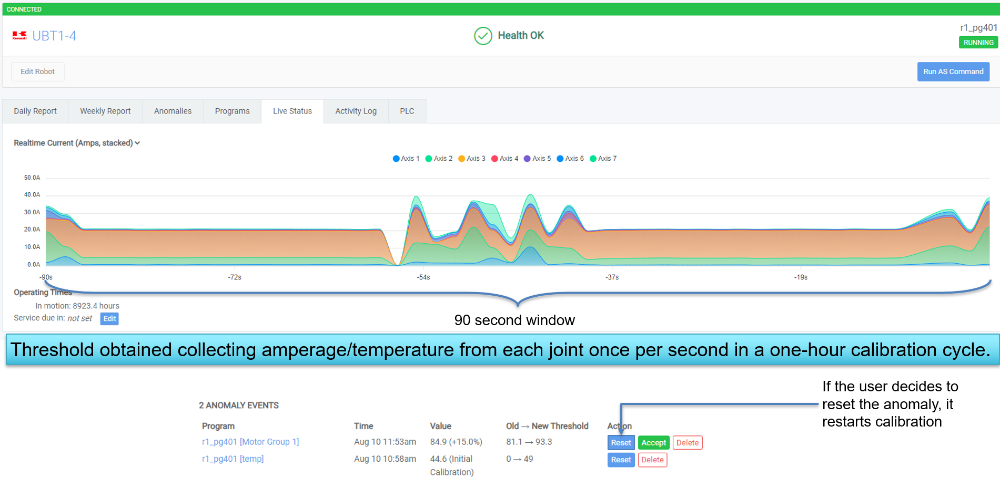

# Streaming-Data-for-Predictive-Maintenance-with-Linear-Regression-Based-Alerts
📂 Practical Lab 1: Streaming Data for Predictive Maintenance with Linear Regression-Based Alerts

## Project Summary
This task simulates a Predictive Maintenance scenario, where early alerts and errors can flag potential failures before they occur.

## ❗ Clarify the Problem

Issue: Torque Tube Failure – 480 Minutes of Downtime
Root cause is the age of the equipment.
Roadblocks: Options to monitor equipment health are limited.
GAP: Lack of a tool to avoid reactive response to equipment breakdown.  

---

### 1. 🧭 Material Handling Operations

### ⚠️ What Goes Wrong Without ProperMaintenance

### 2. 📉 Robot Controller Hardware Configuration

### 3. 📉 Collecting Data from the Robot Controller

### 4. 🧠 Predictive Maintenance Use Case

### 5. ✅ Predictive Maintenance (PM) Architecture

### 6. ➡️ PM Dashboard Design.

### Setup Instruction

